# Write-up BitupCTF

* [Misc - Inosmnia](#misc---insomnia)
* [Web - Fintechno](#web---fintechno)
* [Web - Curvas Peligrosas](#web---curvas-peligrosas)
* [Atomics - Hello World](#atomics---hello-world)
* [Atomics - Demiguise](#atomics---demiguise)
* [Atomics - Hexa](#atomics---hexa)
* [Atomics - Helius 5](#atomics---helius5)
* [Atomics - Un Ciudadano Ejemplar](#atomics---un-ciudadano-ejemplar)

  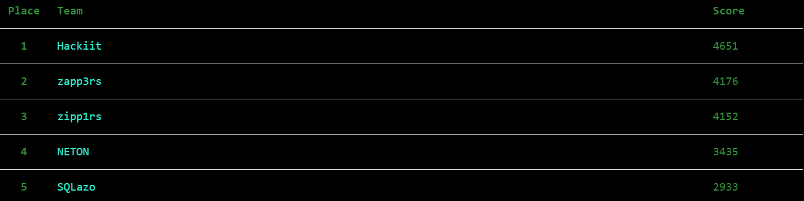

Los miembros de [SQLazo](https://twitter.com/SQLazo) decidimos participar en el CTF del fin de semana pasado organizado por [BitUp Alicante](https://bitupalicante.com/) en el que había buenos premios para los 3 primeros clasificados, buena variedad de retos y donde participaban dos de los tres equipos españoles que nos superan en [CTFTime](https://ctftime.org/stats/ES). Solo pudimos participar 3 miembros de mi equipo pero conseguimos un muy buen 5º puesto, con varios retos que no conseguimos solo por detalles o tonterías. Aquí van algunos writeups:

## Misc - Insomnia

Ficheros: <a href="challs/evil.zip">evil.zip</a>

  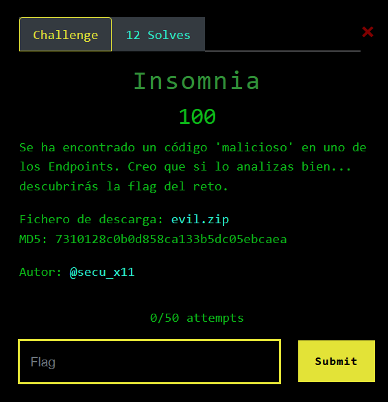

En este reto nos dan un fichero comprimido que contiene otro llamado `kdaWvc7exPjKad3.cs`. Comprobando el tipo de archivo con el comando *file* vemos que es ASCII text, pero al abrirlo en un editor como Sublime vemos que en realidad es un script de **PowerShell**. Lo renombramos para que lo reconozca el *Windows PowerShell ISE* y probamos a ejecutarlo. Nos pide introducir la flag, probamos algo y dice que no es correcta. 

  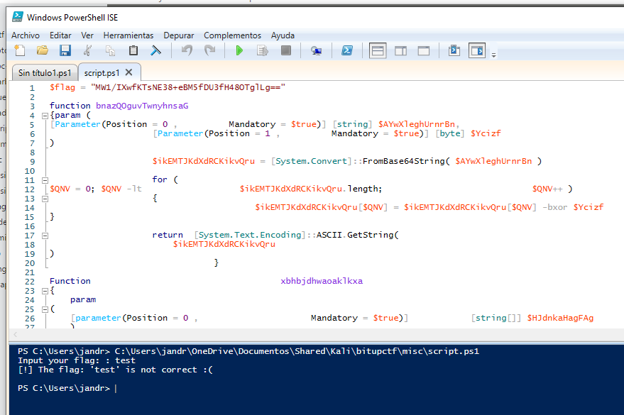

Toca ver el código y tratar de entender qué está ocurriendo. Podemos observar una flag "hardcodeada" cifrada, así que asumo que la introducida por nosotros se cifra en el código y luego se compara con esa. Vemos que el script consta de:
* La flag cifrada
* 4 funciones
* 7 líneas de código
* Un bloque if...else 

El problema de todo esto es que el código parece estar bastante ofuscado, teniendo las variables y funciones nombres muy extraños. Toca entonces renombrarlos con Sublime para tratar de comprender qué hace el código. 
Tras el proceso de *beautify* del script y dándome cuenta de que uno de los valores hardcodeados es *RightToLeft* cifrado (simplemente permite entender mejor que esa función lo que hace es invertir los caracteres), [este es el script resultante](./challs/clean.ps1).

  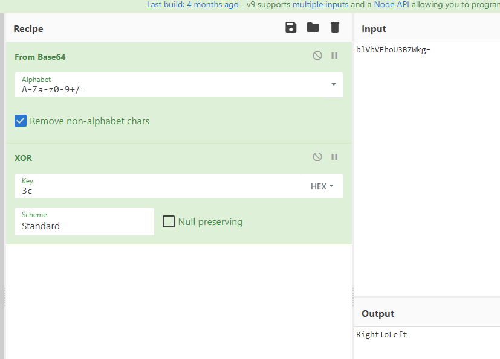

Ya aquí es sencillo ver que la cuarta función nunca se ejecuta y que el proceso que sigue con lo que introducimos es **base64, fun1 (from base64 + XOR con 0x4c), reverse y base64 otra vez**. Entonces invirtiendo el proceso en [CyberChef](https://gchq.github.io/CyberChef/#recipe=From_Base64('A-Za-z0-9%2B/%3D',true)Reverse('Character')XOR(%7B'option':'Hex','string':'0x4c'%7D,'Standard',false)&input=TVcxL0lYd2ZLVHNORTM4K2VCTTVmRFUzZkg0OE9UZ2xMZz09) encontramos la flag del reto
 

  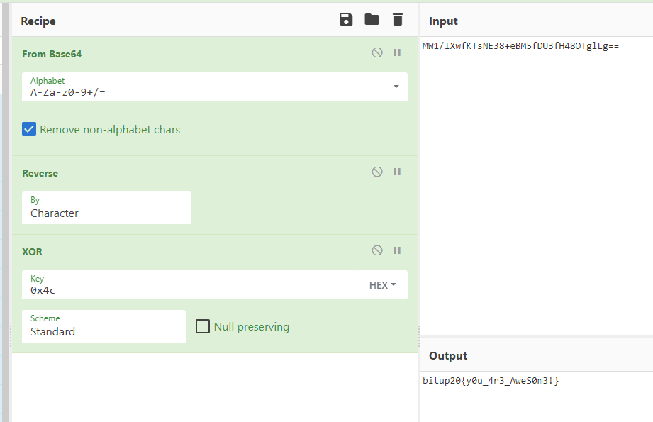

**bitup20{y0u_4r3_AweS0m3!}**

## Atomics - Hello World

  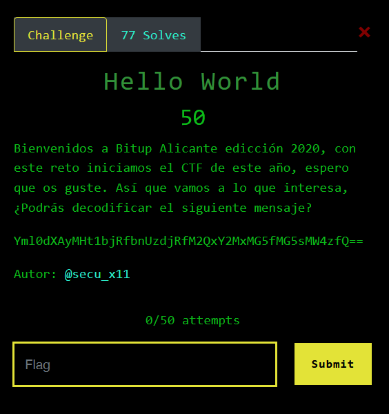

Un **base64** muy evidente. <a href="https://gchq.github.io/CyberChef/#recipe=From_Base64('A-Za-z0-9%2B/%3D',true)&input=WW1sMGRYQXlNSHQxYmpSZmJuVXpkalJmTTJReFkyTXhNRzVmTUc1c01XNHpmUT09IA">Aquí</a> está la solución:

**bitup20{un4_nu3v4_3d1cc10n_0nl1n3}**

## Atomics - Demiguise

  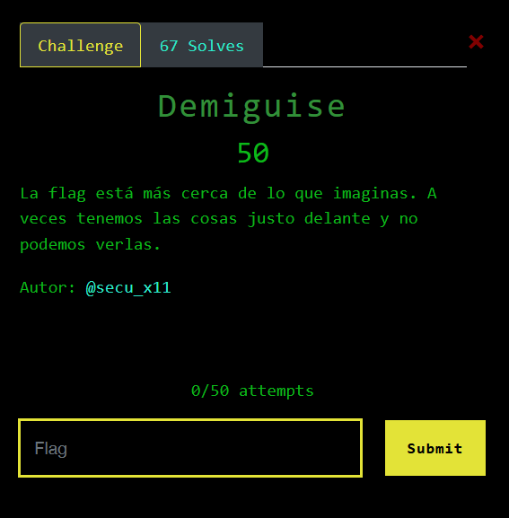

Era otro reto muy sencillo. Siguiendo la idea de la descrìpción, se podía encontrar la flag en el *código fuente* (no hice captura al resolverlo así que tomo la imagen del writeup de los creadores):

  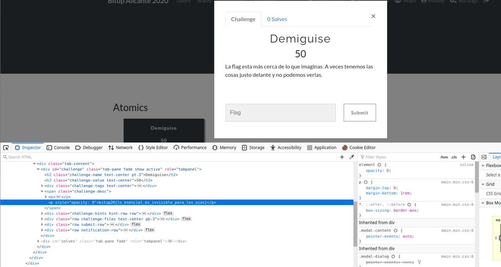

**bitup20{lo_esencial_es_invisible_para_los_ojos}**

## Atomics - Hexa

  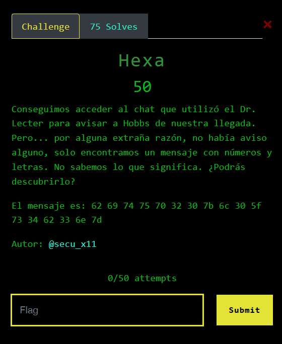

El tercero de los retos simples de Atomics. Nos dicen que es un cifrado en **hexadecimal** así que lo resolvemos una vez más con <a href="https://gchq.github.io/CyberChef/#recipe=From_Hex('Space')&input=NjIgNjkgNzQgNzUgNzAgMzIgMzAgN2IgNmMgMzAgNWYgNzMgMzQgNjIgMzMgNmUgN2Q">CyberChef</a>.

**bitup20{l0_s4b3n}**

## Atomics - Helius 5

Ficheros: <a href="challs/message.wav">message.wav</a>

  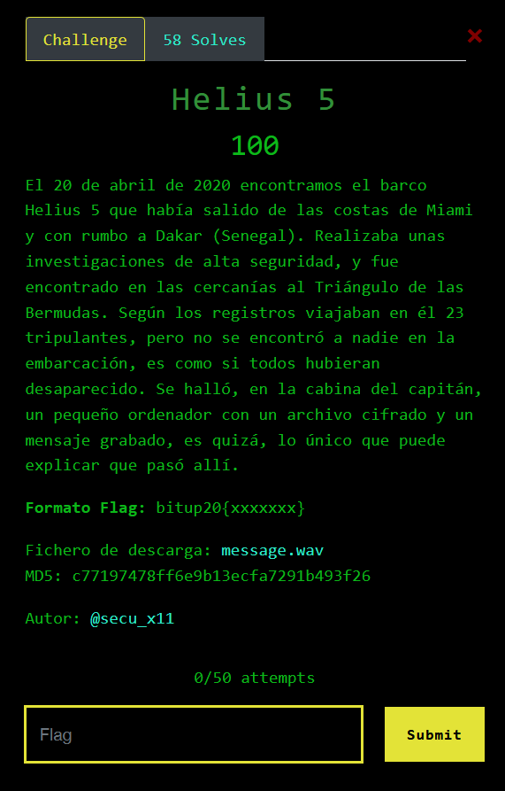

Bueno, este reto presenta una bonita historia y nos da un archivo de audio. Lo reproducimos y parece **código morse**, lo cual concuerda con la historia de la descripción. Vamos a decodificarlo en [este sitio](https://morsecode.world/international/decoder/audio-decoder-adaptive.html) por comodidad:

  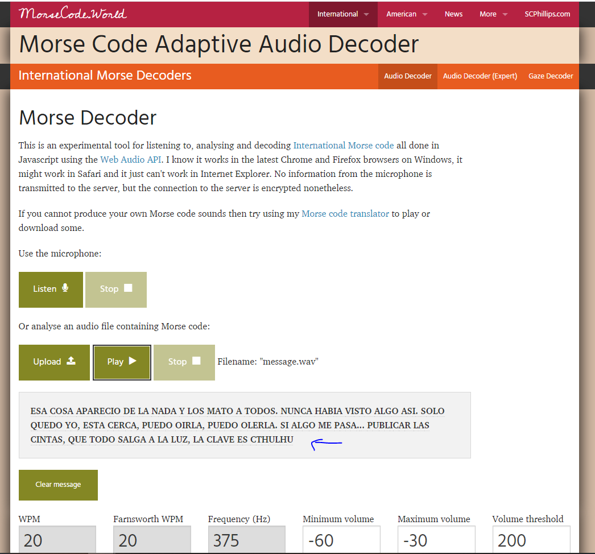

**bitup20{CTHULHU}** (al parecer también valían *Cthulhu* y *cthulhu*)

## Atomics - Un ciu

Ficheros: <a href="challs/me.zip">me.zip</a>

  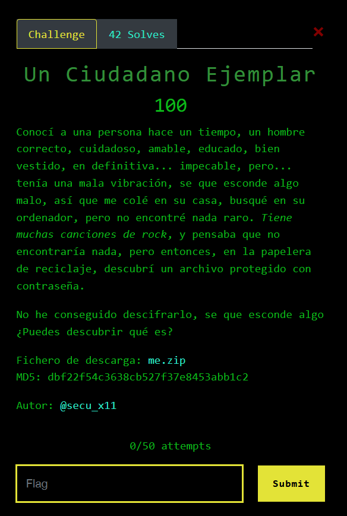

Nos dan un fichero comprimido que tras comprobar con los típicos comandos `file me.zip`, `7z l me.zip` y `zipnote me.zip`, que no hay nada raro, tratamos de descomprimirlo.

Ahí vemos que los ficheros están protegidos con contraseña, así que tendremos que crackear el zip. Como en la descripción hablan del *rock*, mi primera idea fue buscar un wordlist de canciones de rock, pero luego resultó ser mucho más sencillo y era una referencia a **rockyou.txt**, el típico wordlist de Kali. De todos modos probando con el wordlist por defecto de **john** es capaz de extraer la simple contraseña **rabbit**. Antes de poder crackearlo hay que usar **zip2john** para extraer los hashes.

  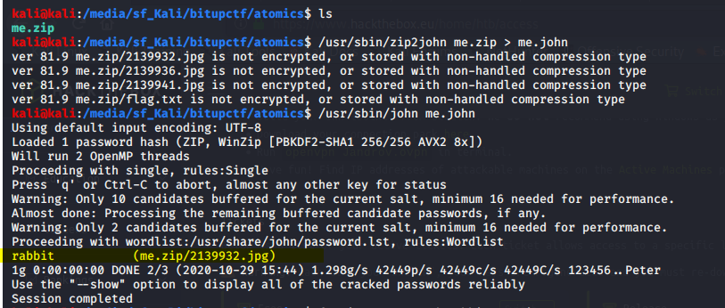

Una vez la tenemos, ya descomprimimos y en el fichero *flag.txt* tenemos la flag:

  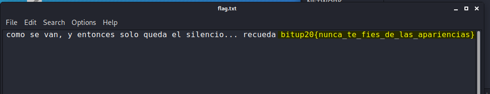

**bitup20{nunca_te_fies_de_las_apariencias}**