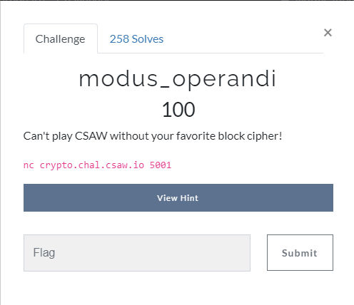
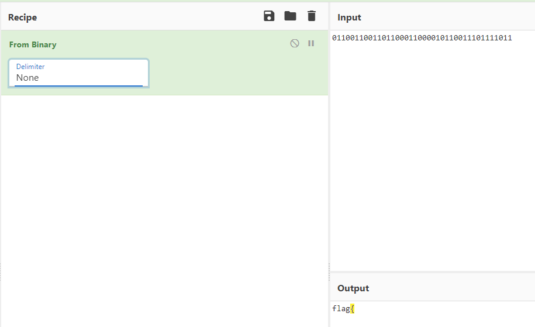
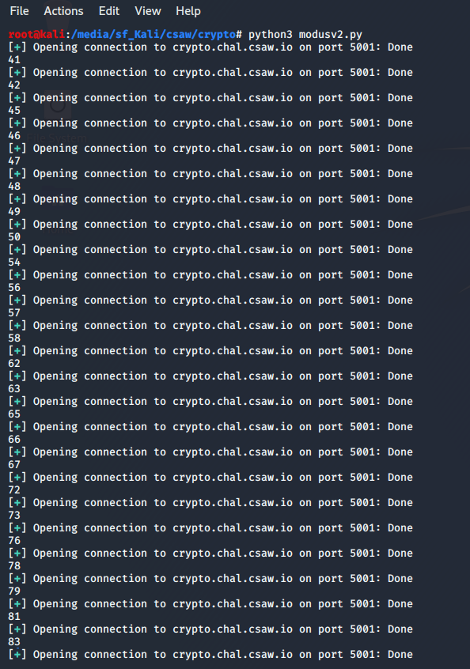
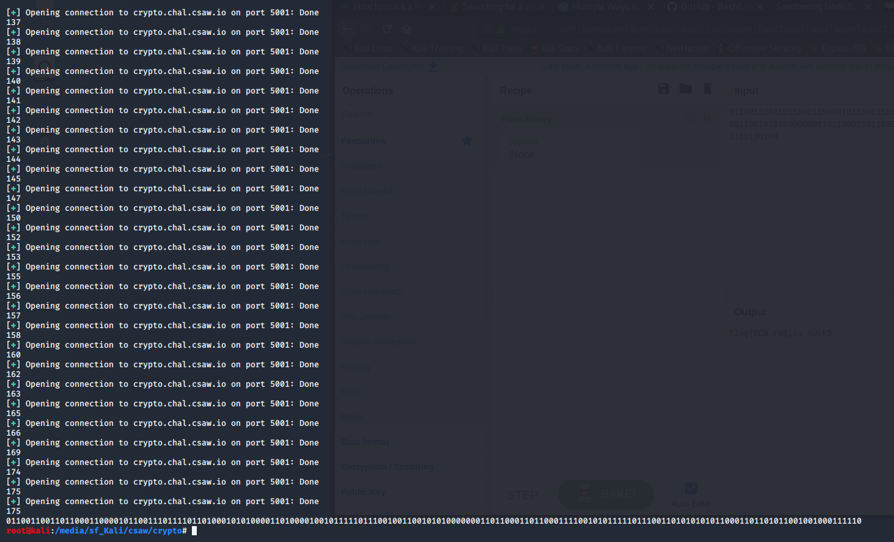
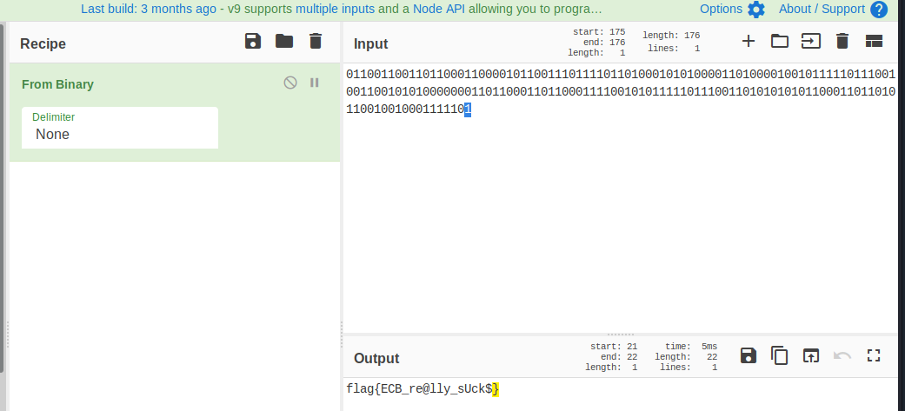

# Write-up CSAWCTF

* [Crypto - modus_operandi](#crypto---modus_operandi)

## Crypto - modus_operandi

  

We see that the challenge runs on their server so we connect from our Kali machine. We are told to enter some plaintext and we get a ciphertext and a question: *was it encrypted with ECB or CBC?*. Then I started to try to get information about how their script works, as we didn't get any file on the challenge description. 

  

I notice that the plaintext is irrelevant and writing the wrong option in the ECB/CBC question, makes the program to stop. Then I start trying to find a pattern and I see that the first sequence is like:
*ECB-CBC-CBC-ECB-ECB-CBC-CBC ...*. This is the moment when I decided to write a python script in order to get the flag. Just something simple using *pwntools* and trying this sequence.

Then I realize that the sequence was more complex and I started to change the values with some *if...else* statements in a little "handy" way. By doing this I had an idea: instead of finishing the correct sequence in order to get the flag from the server, it might be possible that **the correct sequence of ECB-CBC will be the flag itself (like in binary)**. As I had an array with *[b"ECB",b"CBC"]*, I started to append the indexes of the correct values in a string that would store the result. 

To try this approach I decided to get more digits by hand (with those *if...else* on my script) until I could decrypt binary in <a href="https://gchq.github.io/CyberChef/#recipe=From_Binary('None')&input=MDExMDAxMTAwMTEwMTEwMDAxMTAwMDAxMDExMDAxMTEwMTExMTAxMQ">Cyberchef</a> and see that I was going in the right direction:

  

This is the moment when I decided to change my script to bruteforce the rest of the bits, just by appending **0 if it was ECB or 1 if it was CBC** (it was useful to use the indexes of my array as I said before). If I made a mistake, then I reconnected again, taking advantage of all the previous bits I had already found.

It took around half an hour for my <a href=challs/modusv2.py>script</a> to find the flag in binary. This was the result:

  
  

So I just need to decrypt that binary string with <a href="https://gchq.github.io/CyberChef/#recipe=From_Binary('None')&input=MDExMDAxMTAwMTEwMTEwMDAxMTAwMDAxMDExMDAxMTEwMTExMTAxMTAxMDAwMTAxMDEwMDAwMTEwMTAwMDAxMDAxMDExMTExMDExMTAwMTAwMTEwMDEwMTAxMDAwMDAwMDExMDExMDAwMTEwMTEwMDAxMTExMDAxMDEwMTExMTEwMTExMDAxMTAxMDEwMTAxMDExMDAwMTEwMTEwMTAxMTAwMTAwMTAw">Cyberchef</a> again and we can see the flag. It doesn't have the closing curly bracket, but we can assume it.

  

**flag{ECB_re@lly_sUck$}**

