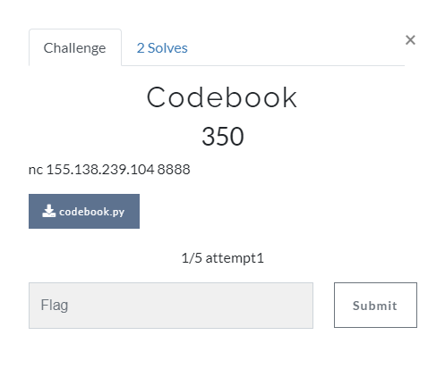
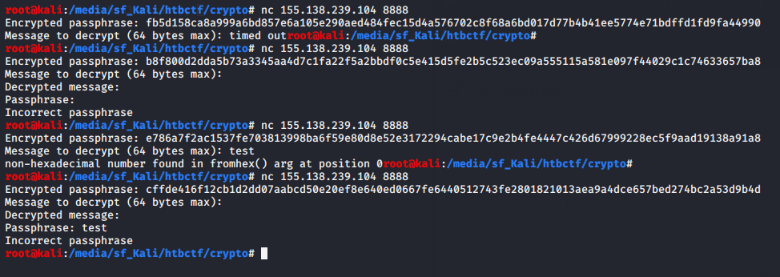
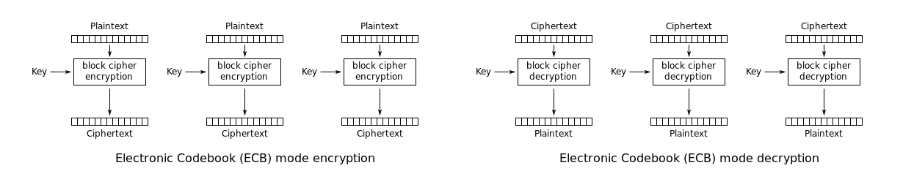
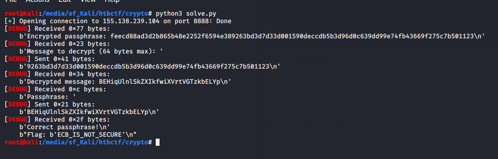

# Write-up Covid rql

* [Crypto - Codebook](#crypto---codebook)
* [Stego - Keep Trying](#stego---keeptrying)

This was a <a href="http://155.138.239.104:8000/">short CTF</a> that one teammate told me about, as the prize for the winner was one year of VIP in HTB. It was late here in Spain but I decided to take part in the competition. It turned out to be interesting and I ended up 2nd with 800 points, just 100 points behind the winner. Only a few people solved some challenges: I started with Stego one but after getting stacked at some point, I changed to *Codebook* one and solved it. I was 3rd after 2 people that solved Stego one (it had more points). After that, this was the sequence...

  

I solved *babystack* 10 minutes before the deadline and I was in the first position! But it didn't last so long...

  

5 minutes after that, *th3d00msl4y3r* uploaded another flag and defeated me.  I was only one step away in the stego challenge from getting the prize! :( 

I could solve a couple challenges and almost a third one, so I will try to share what I got. The writeup for *pwn* challenge might be done in the future if my teammate <a href="https://github.com/Zarkrosh">Zarkrosh</a> helps me, as he is the expert in the topic and helped me with the script. Then, I am writing about a *Crypto* challenge and the *stego* one I almost finished.

## Crypto - Codebook

Files: <a href="challs/codebook.py">codebook.py</a>

  

From this challenge we get a server to connect by *netcat* and the Python script file that is running on that server. First thing I do is connect and try to test briefly how it works:

  

I see that server sends me an encrypted passphrase, asks me for something to decrypt and eventually asks me for the passphrase. I also notice that there is a timeout, so a script will need to be written. This is the moment when I start looking into the Python script and I see that the behaviour is:
1. Set timeout of 2 seconds and generate random key of 16 bytes
1. Generate passphrase of 32 random letters (upper or lower case)
1. Encrypt (with AES ECB and previous generated key) not only the passphrase but also *"Passphrase  is  "* right before it (the length of this prepended string is exactly **16 bytes**, what will be useful). Then send this encoded in hex
1. Receive our message to decrypt, but only allowing messages with length up to 64 bytes
1. Decrypt with AES ECB and the same key than before what we sent and then send it us back
1. Receive the passphrase we write and compare it with the originally generated one:
	1. If they match, we get the flag
	1. Otherwise, we get an error message and connection is closed

It was pretty clear for me that I needed to send their own encrypted message back in order to get the clear passphrase, but unfortunately it is longer than 64 bytes because of that prepended string (it has 96 bytes). Then, the challenge was just to **extract the correct bytes from the encrypted passphrase, send those back, receive the clear passphrase, send it back to the server and get the flag**. Why is this so simple? Because of <a href="https://en.wikipedia.org/wiki/Block_cipher_mode_of_operation#Electronic_codebook_(ECB)">how ECB works</a>. 

  

It splits the message into blocks of 16 bytes and then encrypt each of them using the same key (for example, if you encrypt 32 characters "a", you would see twice the same encrypted message, as the first 16 "a" and the second 16 "a" were encrypted in the same way). Then, if we were so lucky that the prepended message was 16 (32 in hexadecimal) bytes long... Oh, wait, it was just like that! So we have everything we need to write the script and get our first flag (During the process mentioned before, we also need to receive the bytes that the server sends us like *"Decrypted message: "* just to ignore them).

Writing the script <a href="challs/solve.py">solve.py</a> didn't take me too long using *pwntools*, as it was only 10 lines of code and the only difficulty was seeing where to split the extracted strings. Once I had it, I got the flag.
 

  

**FLAG{ECB_IS_NOT_SECURE}**

