# Write-up FwordCTF

* [Forensics - Infection](#forensics---infection)
* [Forensics - NULL](#forensics---null)


## Forensics - Infection

Archivos: <a href="http://download.fword.wtf/foren.E01">foren.E01</a>


> My IT friend told me to highly secure my important files , but my pc got infected. Luckily i made an image of my disk. Can you help me retrieve my secret? PS : If you find a problem concerning the gofile upload, DM discord and mention from where you got the link !


I use file command to check that it is a disk image in EWF format. Then I install ewf-tools (if needed) and mount it on our file system.

<p align="center">
  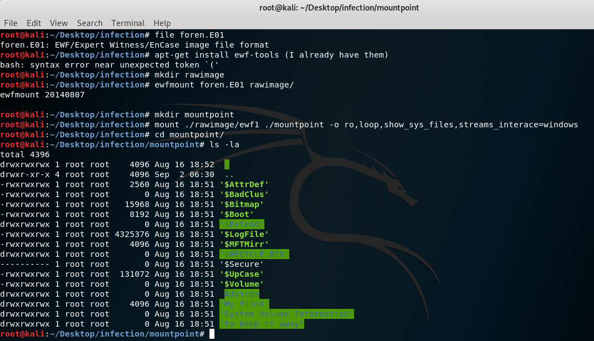
</p>

I can see several files and directories. I start checking their extension and grepping for some keywords, without success. Then I start checking the directories. I start from _Advices_ one, where I can see one file that gives us information about how the secret has been encrypted and then a directory containing an encrypted text. It is represented by a long number.

<p align="center">
  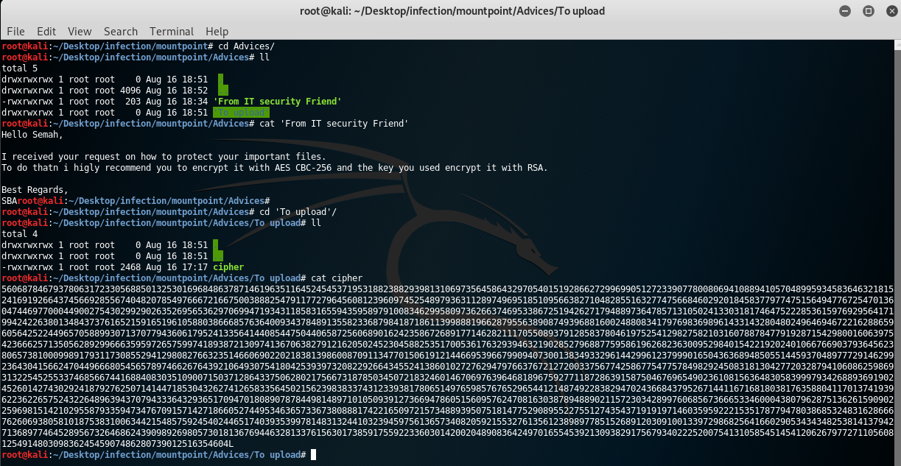
</p>

I copy all the information I gather to a text file because I imagine that otherwise I can get lost (it turned out to be a good idea).

The next directory I check is *My Files*, but it just contains some images that after performing some steganography tests, seem to have no useful information for the challenge. *System Volume Information* is useless too.

Then we go to a suspicious directory called *to keep it away*. It contains both suspicious files: a json and a zip that contains a file encrypted with OpenSSL. I try to unzip the file but there is a problem with the signature that I can check with xxd: header is 504b **0000** when it should be 504b **0304**.

<p align="center">
  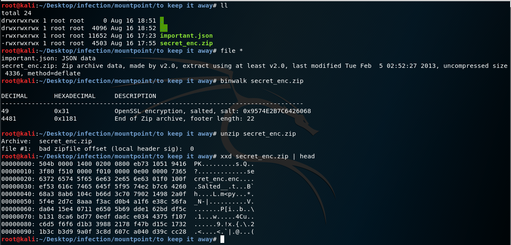
</p>


I copy the zip outside this directory (because it is mounted as read-only) and extract the encrypted file inside it: *secret_enc.enc*. Now it seems I need to find the keys to decrypt it and according to the previous message, they should be RSA keys.

To see the content of the file *important.json* I decide to use <a href="http://jsonviewer.stack.hu/">this website</a>. After checking every single element, I find a suspicious object because of its title: *"Secret - مستندات Google"*. 

<p align="center">
  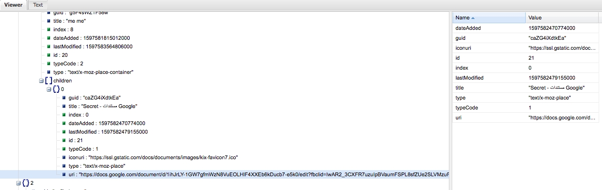
</p>

It has an uri so I enter and it is a <a href="https://docs.google.com/document/d/1ihJrLY-1GW7gfmWzN8VuEOLHlF4XXEb6kDucb7-e5k0/edit?fbclid=IwAR2_3CXFR7uzuIpBVaumFSPL8sfZUe2SLVMzuFb7dfz40GmAkAaFt4U2XKM">Google Document</a> that contains a password.

<p align="center">
  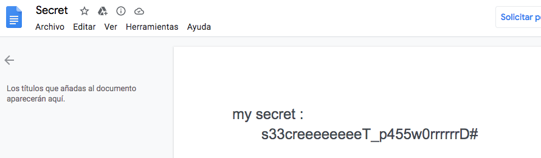
</p>

So there are only two directories left. *$Extend* one is useless so I check *$RECYCLE.BIN*. Inside another directory there are 3 documents. I check the 2 text files and in the 2nd one, *$R4ZNK6Z.txt*, there are two pastebin urls that I decide to check. First one expired but the second one gives us the RSA Public Key.

<p align="center">
  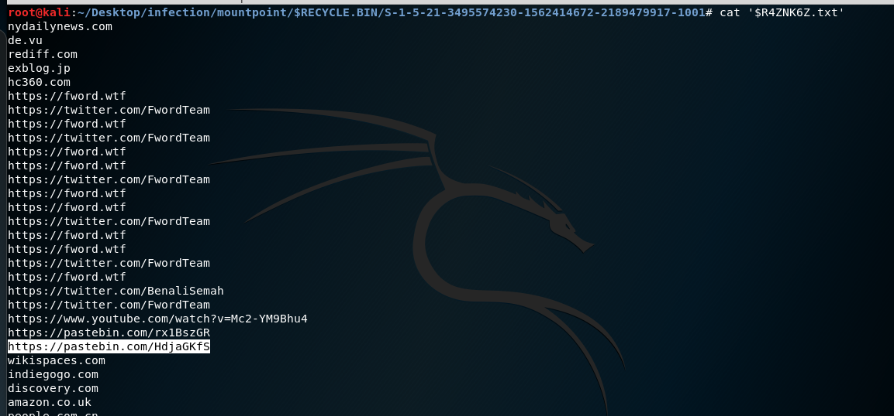
</p>

<p align="center">
  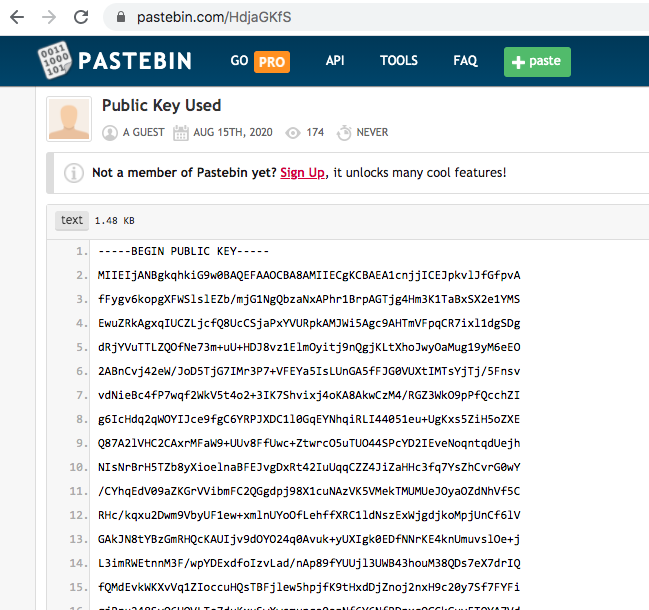
</p>

After writing everything down to a summary file, I need to leave for some hours so I send my research to my teammates and ask them if someone can continue. After some hours, <a href="https://github.com/Zarkrosh">Zarkrosh</a> answers me saying that he could get the RSA Private Key using <a href="https://github.com/Ganapati/RsaCtfTool">this tool</a>. 

```./RsaCtfTool.py --publickey ./key.pub --private```

Then, he tried to decrypt *secret_enc.enc* but it didn't work, so he realizes that *cipher* file 
is the RSA encrypted one and the other one is the AES CBC 256. He asked me if I could continue from here, as he was solving other challenges and I already had a Jupyter notebook to solve those RSA challenges from a ciphertext in "long integer" format.

He sent me the private key file and I extracted the modulus (n) and private exponent (d) following the steps on <a href="https://blog.shines.me.uk/generating-rsa-public-modulus-public-exponent-private-exponent-as-hexdecimals/">this page</a>. (Apparently, RsaCtfTool can do this in an easier way, but I didn't know this tool before. It can be done with --dumpkey --key options)

Then I use my notebook to decrypt the message obtaining this password **s3cuRE_SBA_#!@~?**

<p align="center">
  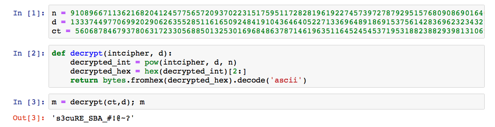
</p>

Once I got this, I could decrypt the encrypted file with OpenSSL:

<p align="center">
  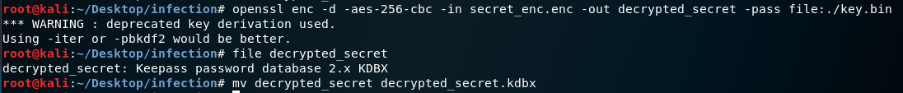
</p>

The result is a keepass database. I didn't have Keepass installed on this computer so I sent Zarkrosh and he accessed the database using the password from Google Document: **s33creeeeeeeeT_p455w0rrrrrrD#**

<p align="center">
  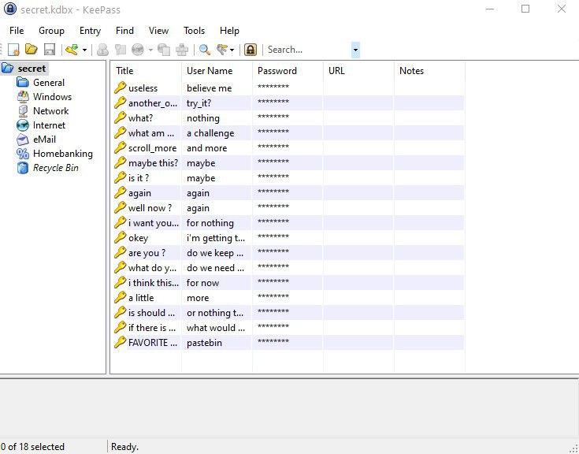
</p>

After a lot of trolling users and passwords, at the end he finds a password that has an url: https://gofile.io/d/YNd4VZ 
It was the *gofile* mentioned in the challenge description, so he asked the admin and after a while, he received a zip file: <a href="challs/favorite.zip">favorite.zip</a>

<p align="center">
  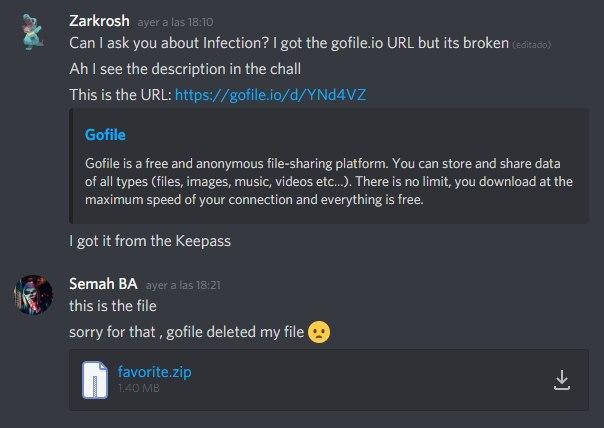
</p>

He uncompressed it and saw two files. He could only identify the format of one of them, that was a hexdump. He saw the magic bytes of a PNG so he reversed it using xxd. Then with binwalk he saw an ELF file at the end that he extracted with dd. I recreate the steps he performed and I show them on the next image:

<p align="center">
  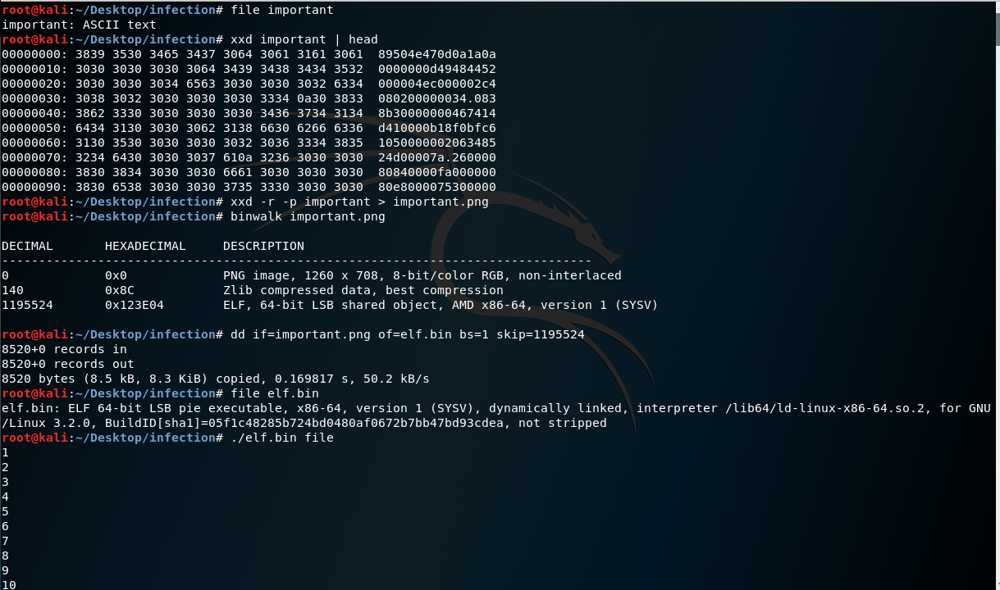
</p>

So now we had the strange file called *file* and the ELF one. Executing the last one just printed a sequence of integers so he decided to send me those files to see if I could finish the challenge.

I decide to execute it using the strange file as an argument and I see that a file called *out* was created. 

I see its bytes and realize that after 3000 bytes of zeros, there is a JPEG image.

<p align="center">
  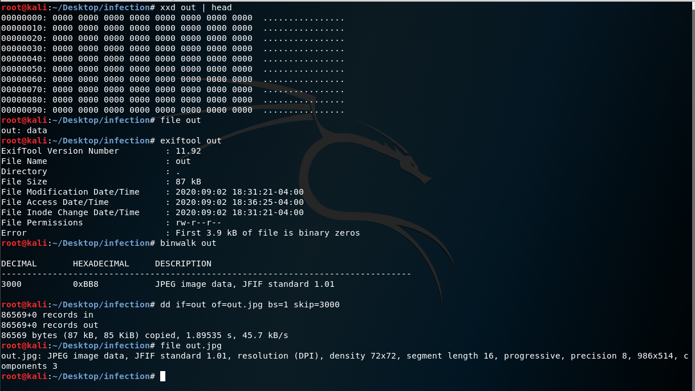
</p>

I open the image and...**THERE IS THE FLAG!**

<p align="center">
  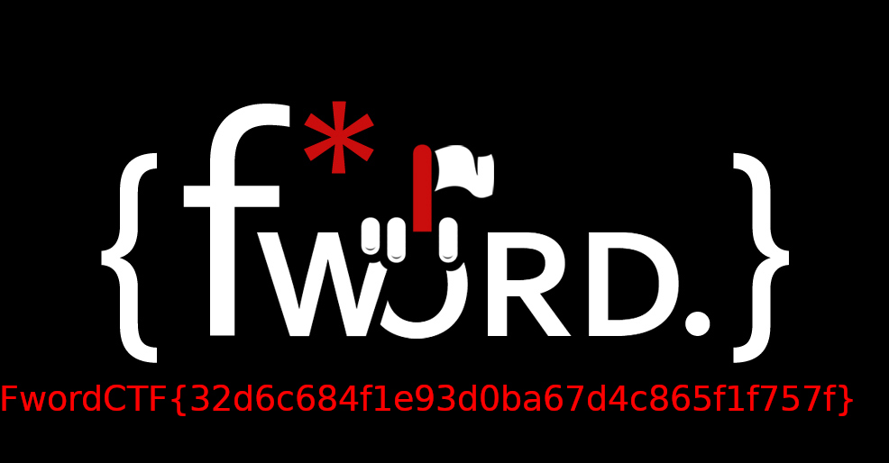
</p>

**FwordCTF{32d6c684f1e93d0ba67d4c865f1f757f}**

*(Only 16 teams solved this challenge)*


## Forensics - NULL

Archivos: <a href="challs/NULL">NULL</a>

<p align="center">
  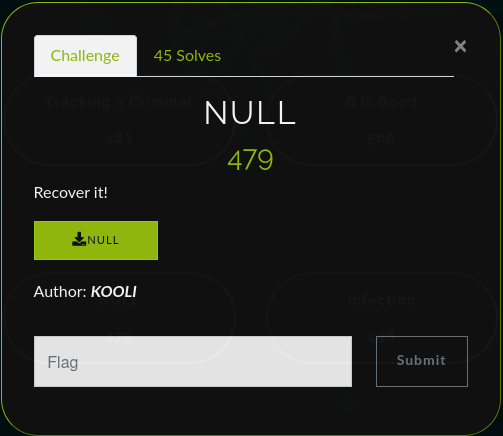
</p>

The file seems to be corrupted so I open it with *hexeditor*. 

<p align="center">
  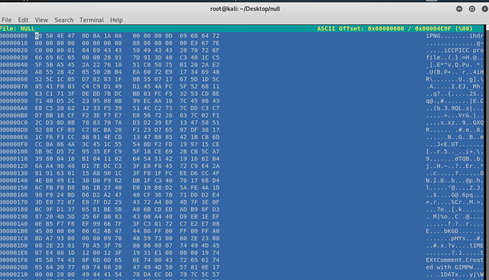
</p>

It can be seen that first byte is wrong as PNG file signature is **8950 4e47 0d0a 1a0a** and we have **69** in the first byte. Then I read about <a href="http://www.libpng.org/pub/png/spec/1.2/PNG-Chunks.html">PNG signature</a> and I notice that **IHDR** chunk is also corrupted, as it is in lower case instead of upper case. I change **6968 6472** for **4948 4452** and everything else seems to be correct. 

<p align="center">
  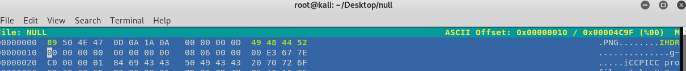
</p>

Well, not everything, as I notice that the image dimensions are **0x0**. At this point I imagine that the challenge will be related to CRC, but let's check it with *pngcheck* (I always these flags but I guess they are not needed for this challenge).

<p align="center">
  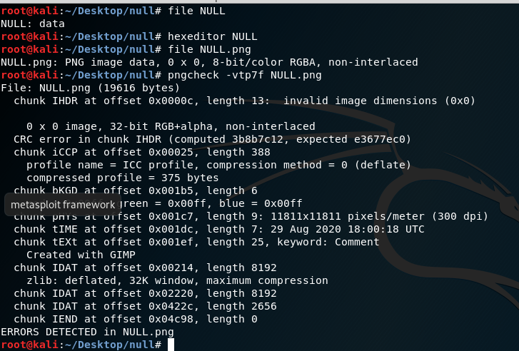
</p>

I noticed this because I already had experience with a challenge like this one, from another CTF some months ago. The challenge here is to find dimensions that match this CRC checksum, as something else would make the PNG open completely corrupted and without a way to see anything. I used <a href="http://www.libpng.org/pub/png/spec/1.2/PNG-Structure.html">this page</a> to read about CRC and I saw that it doesn't count the length field. Then, I remembered that I found a really useful tool for this problem: <a href="https://github.com/resilar/crchack">crchack</a>

I just needed to check once again how to use it correctly, by choosing which bytes I wanted to modify. Firstly I use *dd* to extract the 17 bytes that are used to calculate the CRC checksum. Then, I use the tool to modify 6th, 7th, 10th and 11th bytes, as image dimensions are usually there. Automatically, I get the result.

<p align="center">
  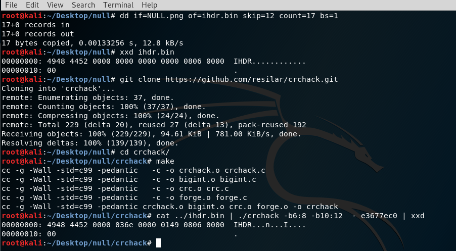
</p>

Now I only need to change those bytes using *hexeditor* again, save the file as <a href="imgs/solution.png">solution.png</a> and read the flag there!

<p align="center">
  
</p>

**FwordCTF{crc32_is_the_way}**

*(Funny fact is that I was the 2nd person that solved this challenge and I lost the first blood because I decided to go to eat dinner between noticing that it was a CRC challenge and actually solving it. At the end, 45 teams solved it)*

