# Write-up Covid rql

* [Crypto - Codebook](#crypto---codebook)
* [Stego - Keep Trying](#stego---keep-trying)

This was a <a href="http://155.138.239.104:8000/">short CTF</a> that one teammate told me about, as the prize for the winner was one year of VIP in HTB. It was late here in Spain but I decided to take part in the competition. It turned out to be interesting and I ended up 2nd with 800 points, just 100 points behind the winner. Only a few people solved some challenges: I started with Stego one but after getting stacked at some point, I changed to *Codebook* one and solved it. I was 3rd after 2 people that solved Stego one (it had more points). After that, this was the sequence...

<p align="center">
  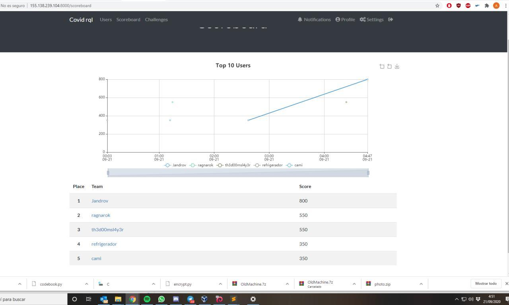
</p>

I solved *babystack* 10 minutes before the deadline and I was in the first position! But it didn't last so long...

<p align="center">
  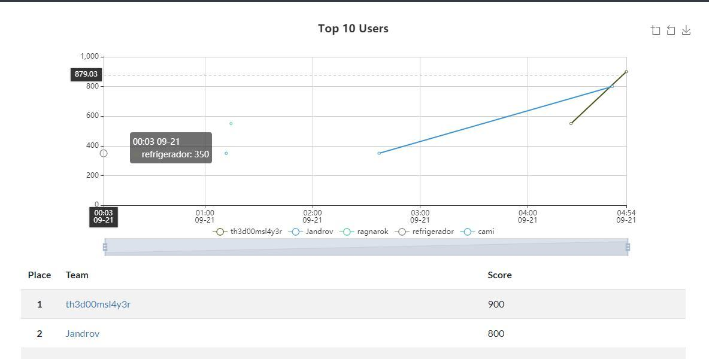
</p>

5 minutes after that, *th3d00msl4y3r* uploaded another flag and defeated me.  I was only one step away in the stego challenge from getting the prize! :( 

To sum up, I could solve a couple challenges and almost a third one, so I will try to share what I got. The writeup for *pwn* challenge might be done in the future if my teammate <a href="https://github.com/Zarkrosh">Zarkrosh</a> helps me, as he is the expert in the topic and helped me with the script. Then, I am writing about a *Crypto* challenge and the *stego* one I almost finished.

## Crypto - Codebook

Files: <a href="challs/codebook.py">codebook.py</a>

<p align="center">
  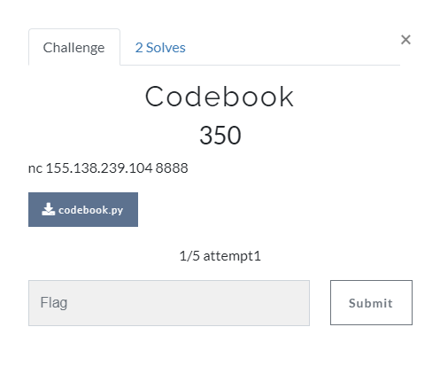
</p>

From this challenge we get a server to connect by *netcat* and the Python script file that is running on that server. First thing I do is connect and try to test briefly how it works:

<p align="center">
  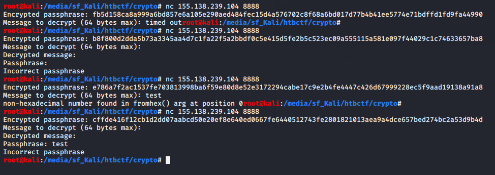
</p>

I see that server sends me an encrypted passphrase, asks me for something to decrypt and eventually asks me for the passphrase. I also notice that there is a timeout, so a script will need to be written. This is the moment when I start looking into the Python script and I see that the behaviour is:
1. Set timeout of 2 seconds and generate random key of 16 bytes
1. Generate passphrase of 32 random letters (upper or lower case)
1. Encrypt (with AES ECB and previous generated key) not only the passphrase but also *"Passphrase  is  "* right before it (the length of this prepended string is exactly **16 bytes**, what will be useful). Then send this encoded in hex
1. Receive our message to decrypt, but only allowing messages with length up to 64 bytes
1. Decrypt with AES ECB and the same key than before what we sent and then send it us back
1. Receive the passphrase we write and compare it with the originally generated one:
	1. If they match, we get the flag
	1. Otherwise, we get an error message and connection is closed

It was pretty clear for me that I needed to send their own encrypted message back in order to get the clear passphrase, but unfortunately it is longer than 64 bytes because of that prepended string (it has 96 bytes). Then, the challenge was just to **extract the correct bytes from the encrypted passphrase, send those back, receive the clear passphrase, send it back to the server and get the flag**. Why is this so simple? Because of <a href="https://en.wikipedia.org/wiki/Block_cipher_mode_of_operation#Electronic_codebook_(ECB)">how ECB works</a>. 

<p align="center">
  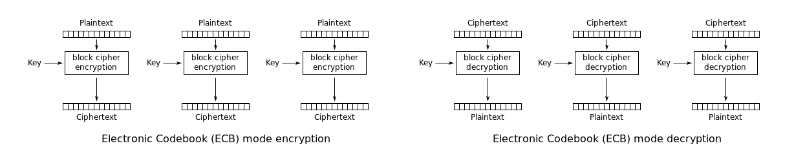
</p>

It splits the message into blocks of 16 bytes and then encrypt each of them using the same key (for example, if you encrypt 32 characters "a", you would see twice the same encrypted message, as the first 16 "a" and the second 16 "a" were encrypted in the same way). Then, if we were so lucky that the prepended message was 16 (32 in hexadecimal) bytes long... Oh, wait, it was just like that! So we have everything we need to write the script and get our first flag (During the process mentioned before, we also need to receive the bytes that the server sends us like *"Decrypted message: "* just to ignore them).

Writing the script <a href="challs/solve.py">solve.py</a> didn't take me too long using *pwntools*, as it was only 10 lines of code and the only difficulty was seeing where to split the extracted strings. Once I had it, I got the flag.
 
<p align="center">
  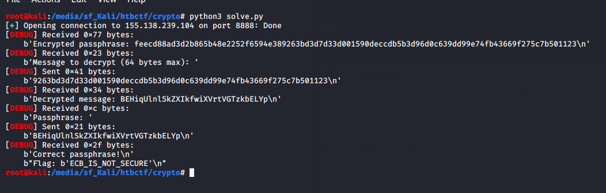
</p>

**FLAG{ECB_IS_NOT_SECURE}**


## Stego - Keep Trying

Files: <a href="challs/photo.zip">photo.zip</a>

<p align="center">
  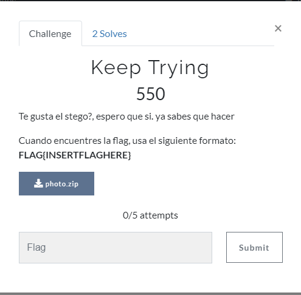
</p>

> Do you like stego?. I hope that. You already know what to do.
> When you find the flag, use the following format: FLAG{INSERTFLAGHERE}

I need to say that this challenge was the longest in stego I've ever had, but well, kind of entertaining :)

We get a zip file that firstly I check with `7z l photo.zip` and then I extract with `7z x photo.zip`. Whatever decompressing tool is valid. I also checked if the zip had a comment with `zipnote photo.zip`, but nothing was found. 

<p align="center">
  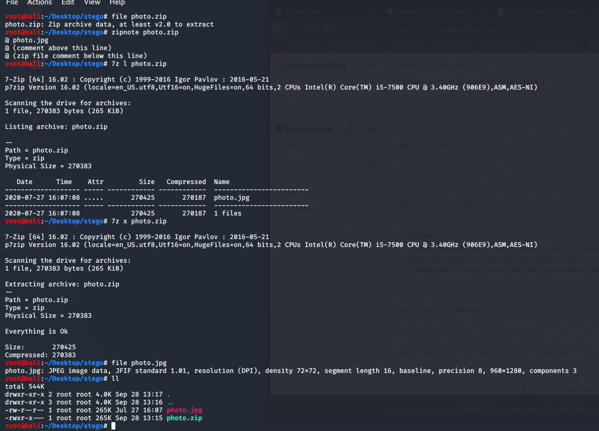
</p>

I get an image, so let's open it.

<p align="center">
  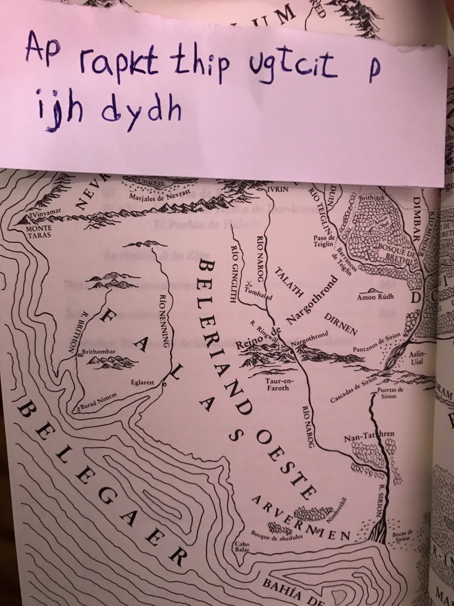
</p>

There is a text that looks encrypted with just a rotation cipher. I write it on <a href="https://gchq.github.io/CyberChef/#recipe=ROT13(true,true,11)&input=QXAgcmFwa3QgdGhpcCB1Z3RjaXQgcCBpamggZHlkaA">CyberChef</a> and it is decrypted with **ROT11** as *La clave esta frente a tus ojos* (in English: *The key is in front of your eyes*). It made me think that there was a password-protected file inside the image. But what was the password?

If we see the image, it shows a map of a region of the *<a href="https://en.wikipedia.org/wiki/Beleriand">Middle-earth</a>*, from *The Lord of the Rings* (I am not into LOTR, but I just googled the first name I saw on the map: Beleriand). Nothing seems clear, so I guessed that one of those names would be the password. I wasn't sure how to automate the process, so I just tried each name until I found that the password was **TALATH**. 

<p align="center">
  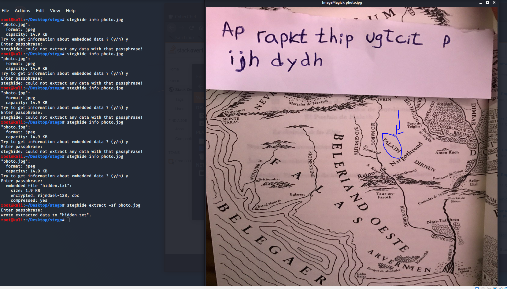
</p>

I said "each name" because unfortunately I think I tried almost each of them before this one, I don't know why I chose that order... We get a text file and luckily this time I didn't waste a minute as I recognized the steganography technique at first glance: <a href="https://dl.packetstormsecurity.net/crypt/snow/description.html">**SNOW**</a>. It is easy to notice if you see the tabs and spaces on each line (just for the record, I also checked where that text came from and it was from *La Naranja Mecánica*, the Spanish version of *A Clockwork Orange*).

<p align="center">
  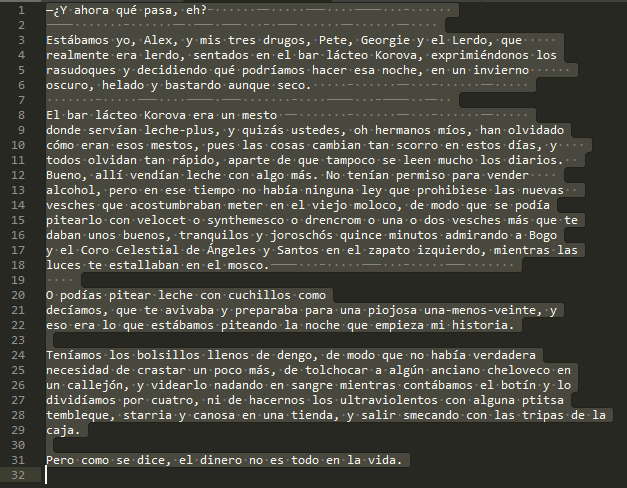
</p>

I extract the hidden text with **stegsnow** (you can read more about it <a href="https://delightlylinux.wordpress.com/2016/12/14/hide-text-in-text-files-using-stegsnow/">here</a>):

<p align="center">
  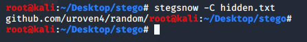
</p>

It is a <a href="https://github.com/uroven4/random">GitHub repository</a>, so let's check it. This is where the challenge started to have some parts of OSINT. There are 4 "hello world" files that don't seem to have anything interesting, so I check the commits and I find a couple with useful information. First one shows a link to an <a href="https://www.flickr.com/photos/189491566@N04/50160413911/">image on Flickr</a> and second one gives a future advice. Translated to English it says: 

> I come from the future to give you an advice.
> When you finish your journey, you must reduce the distances of what you are looking for.

<p align="center">
  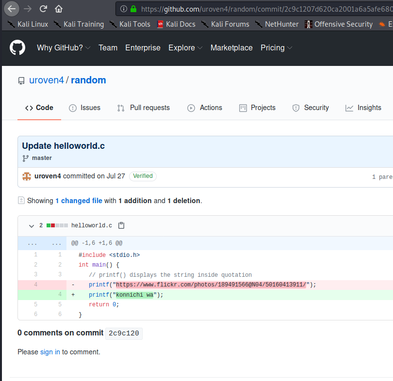
  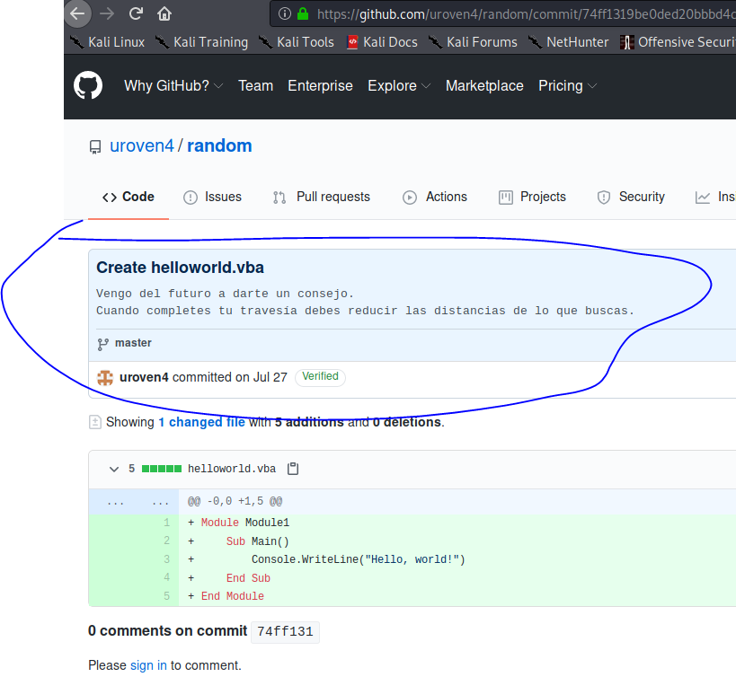
</p>

I download the image from Flickr and I don't see anything useful opening it this time, so I start running some steganography tools. Nothing typical works so I try to crack a possible password with <a href="https://github.com/Paradoxis/StegCracker">**stegcracker**</a>. It works, so we get an email address.

<p align="center">
  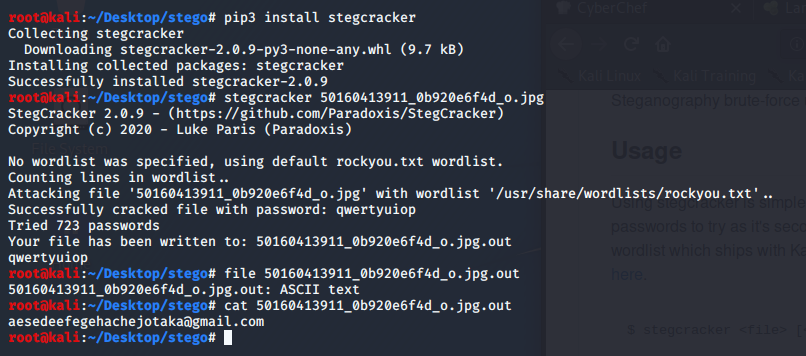
</p>

Here I got stacked for a while, as I was just trying to log into a Gmail, CTF or GitHub account with the email address *aesedeefegehachejotaka@gmail.com*. Eventually, I was suggested to send an email to this address and this was the way. It automatically replies you with an email containing the next part of the challenge. 

<p align="center">
  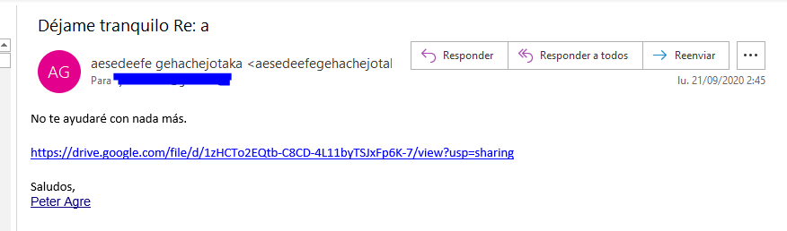
</p>

There are two links there. <a href="https://drive.google.com/file/d/1zHCTo2EQtb-C8CD-4L11byTSJxFp6K-7/view?usp=sharing">Firstly</a> to a file on Google Drive that I download and it turns out to be a zip file. <a href="https://en.wikipedia.org/wiki/Peter_Agre">Second</a> one is the Wikipedia site of an American physician, Nobel Laureate, and molecular biologist: Peter Agre. I didn't know what to do with the second link, so I repeated the same process than at the beginning of the challenge with the zip file and I extracted <a href="challs/pentagram.jpg">pentagram.jpg</a>. 

This time I get a <a href="https://pastebin.com/LjAxp6Mp">pastebin link</a> just by checking the metadata with *exiftool*.

<p align="center">
  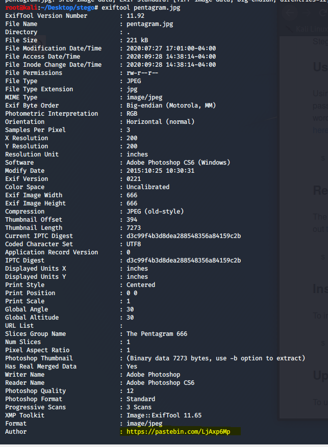
</p>

It contains this text, that clearly looks like **Base64** encoded:

```
QE5dLGhATl0sZ0A6Qz9nK0NcYmcrQ1NcZSQ9UkBQQDNCI2dAM0IiZEAzQiJkQFVgZVUrQ1xiJUA6RVlSK0NcYWRAOkVZUytDU1xlK0NcZWgrQ1FDJUAzQXVmQE5dKWZAMSRFY0BVV15nQFVVQmZAVWBkaEBVVUJnQDo8UmVAOjxST0BVV19UK0NcYmdATl0sJkA6PFVmQFVVQmdAOkJSUUBVYGRoQFVVQmdAVV5IZytDXGFkQFVVQmZAVVdeZ0BVVUJmQDpFXFNAMSRJUEA6Qz9nK0NcYmcrQ1NcZSQ9W0ZRQE5dLGcrQ1NcJEBOXSlnK0NRQyRAOjlMT0BVXkhoK0NTX2ZATl0saCtDXGJnJD1SQFBAM0IjZ0AzQiJkQFVVQmdAVVVCZkBMP09RK0NTXGUkPVtJUkBOXSxnK0NcZWgkPVAmZCtDXGJnK0NTXCRAVV5IZ0BOXSxnK0NTX2crQ1NcZSQ9W0lRQDo6OWVAOkVcVCQ9UkBQQFVdW1JAOjxSZUA6PFNRQE5dLGhAOjxST0BVV15nQDo8VlNATl0pZ0BVYGRSQDo6OWZAVWBlVStDXGVoQDo5TFBAOjxTUStDU19nQFVdW1JAVVdcUitDXGVnQDo5TFBAVVdcUitDU1xmQFVdW1JAOjxTUStDU19nQFVdW1FAVV5IaCtDU1xlQFVdW1JAVVdcUitDU1xlQDpCUlFAOkVbZ0A6PFZTQE5dLGhAVVdbUEA6RVxUQEw/UlJAVWBkaEBVYGVUQDEkRk9AOkVbUUA6PFZTQEs=
```

I start decrypting with CyberChef again and I get stacked for a while after first base64 decoding. Eventually, after several trials, I decode it with **Base85** and the text only contains letters *a* and *b*. Then, while I am trying something similar, Zarkrosh tells me that after replacing **a with -** and **b with .** you can decode it from **Morse** and get a readable Spanish message. Here there is the decryption <a href="https://gchq.github.io/CyberChef/#recipe=From_Base64('A-Za-z0-9%2B/%3D',true)From_Base85('!-u')Find_/_Replace(%7B'option':'Regex','string':'b'%7D,'.',true,false,true,false)Find_/_Replace(%7B'option':'Regex','string':'a'%7D,'-',true,false,true,false)From_Morse_Code('Space','Line%20feed')&input=UUU1ZExHaEFUbDBzWjBBNlF6OW5LME5jWW1jclExTmNaU1E5VWtCUVFETkNJMmRBTTBJaVpFQXpRaUprUUZWZ1pWVXJRMXhpSlVBNlJWbFNLME5jWVdSQU9rVlpVeXREVTF4bEswTmNaV2dyUTFGREpVQXpRWFZtUUU1ZEtXWkFNU1JGWTBCVlYxNW5RRlZWUW1aQVZXQmthRUJWVlVKblFEbzhVbVZBT2p4U1QwQlZWMTlVSzBOY1ltZEFUbDBzSmtBNlBGVm1RRlZWUW1kQU9rSlNVVUJWWUdSb1FGVlZRbWRBVlY1SVp5dERYR0ZrUUZWVlFtWkFWVmRlWjBCVlZVSm1RRHBGWEZOQU1TUkpVRUE2UXo5bkswTmNZbWNyUTFOY1pTUTlXMFpSUUU1ZExHY3JRMU5jSkVCT1hTbG5LME5SUXlSQU9qbE1UMEJWWGtob0swTlRYMlpBVGwwc2FDdERYR0puSkQxU1FGQkFNMElqWjBBelFpSmtRRlZWUW1kQVZWVkNaa0JNUDA5UkswTlRYR1VrUFZ0SlVrQk9YU3huSzBOY1pXZ2tQVkFtWkN0RFhHSm5LME5UWENSQVZWNUlaMEJPWFN4bkswTlRYMmNyUTFOY1pTUTlXMGxSUURvNk9XVkFPa1ZjVkNROVVrQlFRRlZkVzFKQU9qeFNaVUE2UEZOUlFFNWRMR2hBT2p4U1QwQlZWMTVuUURvOFZsTkFUbDBwWjBCVllHUlNRRG82T1daQVZXQmxWU3REWEdWb1FEbzVURkJBT2p4VFVTdERVMTluUUZWZFcxSkFWVmRjVWl0RFhHVm5RRG81VEZCQVZWZGNVaXREVTF4bVFGVmRXMUpBT2p4VFVTdERVMTluUUZWZFcxRkFWVjVJYUN0RFUxeGxRRlZkVzFKQVZWZGNVaXREVTF4bFFEcENVbEZBT2tWYlowQTZQRlpUUUU1ZExHaEFWVmRiVUVBNlJWeFVRRXcvVWxKQVZXQmthRUJWWUdWVVFERWtSazlBT2tWYlVVQTZQRlpUUUVzPQ">all-in-one</a>.

And this is the result and the last step of the challenge that I couldn't solve in time :(

> ESPERO QUE TE HAYA COSTADO TRABAJO LLEGAR HASTA ACA, PERO LAMENTO DECIR QUE AUN NO HAS TERMINADO 27 7 J92 R76 M53 16 22 27 16 DE8 29 L73 6 53 8 7

In English it is:

> I HOPE IT WAS HARD FOR YOU TO GET HERE, BUT I AM SORRY TO SAY THAT YOU HAVEN'T FINISHED YET 27 7 J92 R76 M53 16 22 27 16 DE8 29 L73 6 53 8 7


So the ciphertext seems to be **27 7 J92 R76 M53 16 22 27 16 DE8 29 L73 6 53 8 7**. Time was running out and we didn't find the solution, so as I explained before, during this time, Zarkrosh and I solved the pwn challenge *babystack* so I was winning, but then I lost the first position in a matter of minutes. But what was the last step? The answer was related to our former scientist!

The text was encrypted using **periodic table cipher**. I didn't know this one existed, but just using for example the tool in dcode.fr you can get the solution:

<p align="center">
  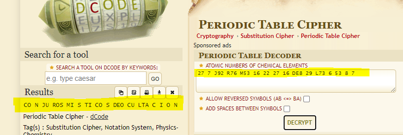
</p>

To finish and get the flag we need to follow the previous advice we saw on GitHub: 

> I come from the future to give you an advice.
> When you finish your journey, you must reduce the distances of what you are looking for.

Although it is quite obvious if you understand Spanish, but we follow this and we see that the flag is *CONJURO MISTICO DE OCULTACION* (in English: *MYSTICAL HIDING SPELL*). In the proper format:

**FLAG{CONJUROMISTICODEOCULTACION}**